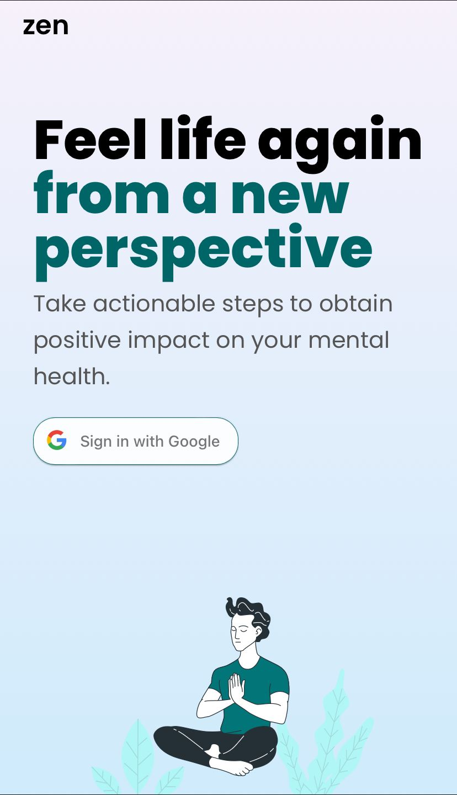
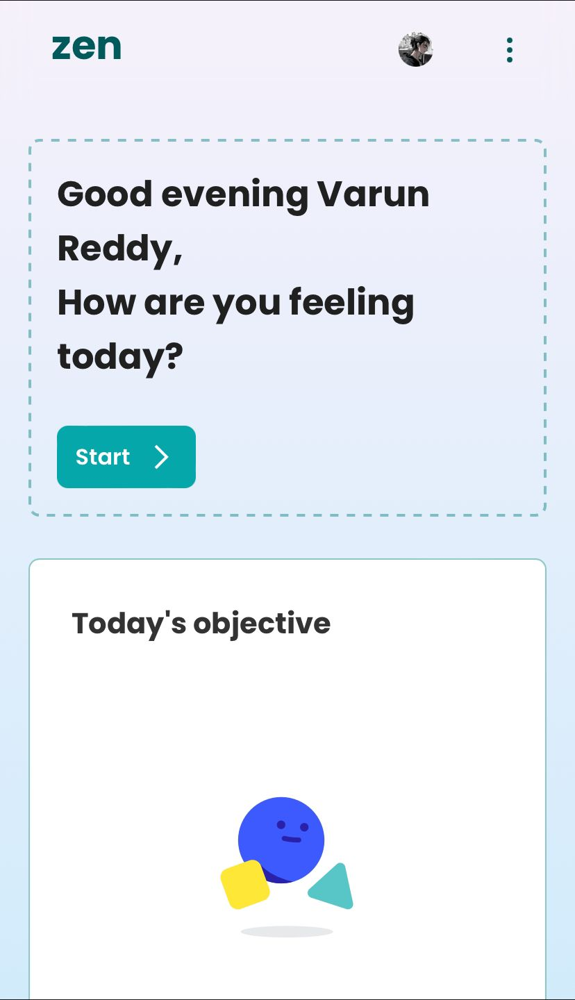
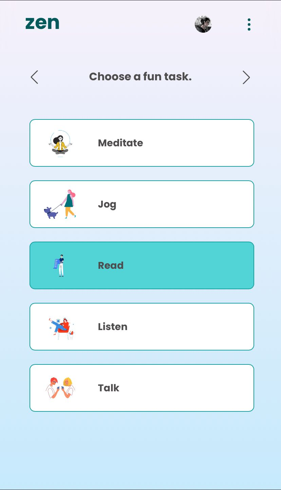
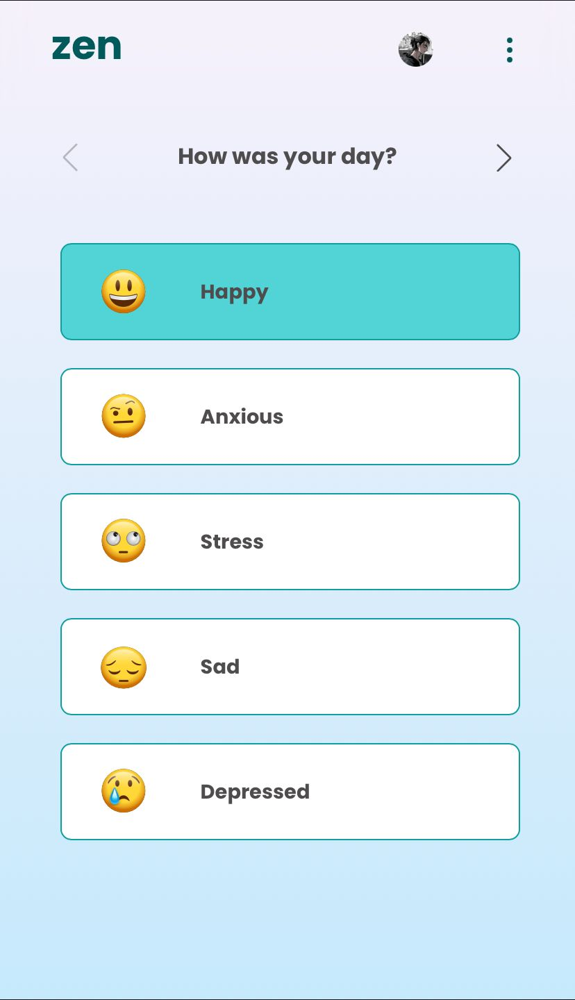
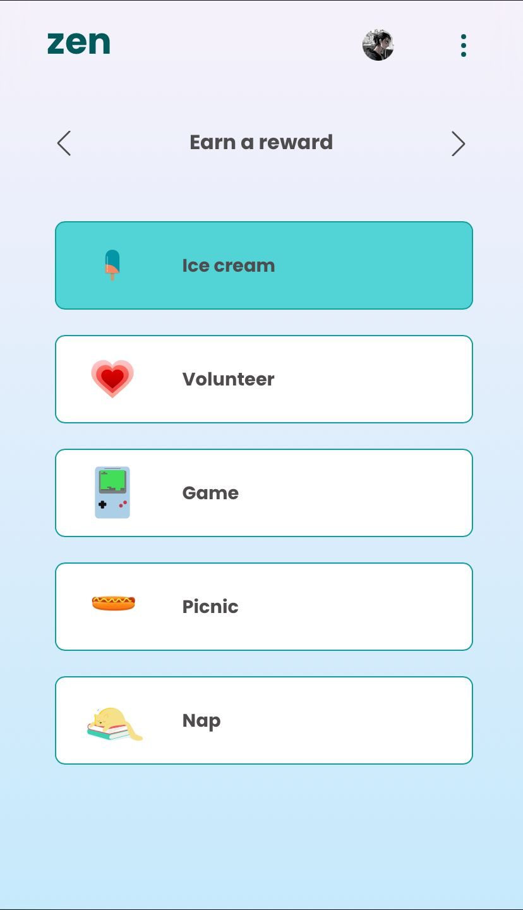
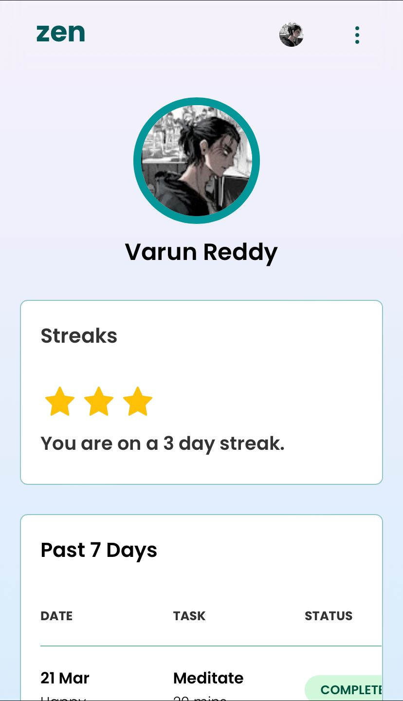
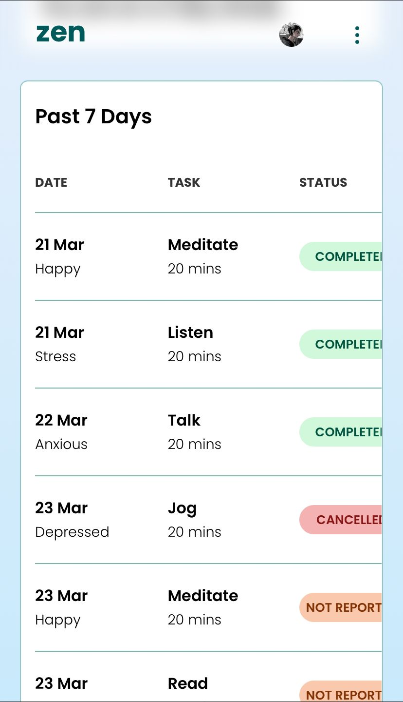
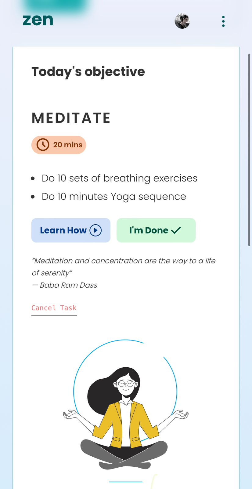
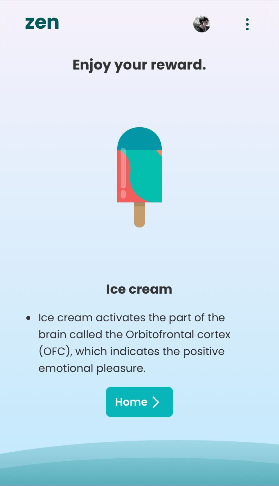

# zen

zen is a web programme that uses gamification to manage stress, anxiety, and sadness in an active way to bring relief. We created ebb to answer the problem statement of leveraging technology to help people cope with stress, anxiety, and depression.We aim to assist those suffering from stress, anxiety, or depression recognise they can take control of their situation and take action to improve their mental health.An immersive task-based journey that encourages individuals to find themselves and grow emotionally in order to be completely present in the moment.

# how?

zen calculates the user's stress/anxiety/depression level to be spent on a certain set of activities before the end of the day. By doing so, consumers unintentionally take actionable efforts to address their ailment.

Users then chose what activities to do with their days and what reward they will receive for doing them.

When users return, zen urges them to reward themselves before re-evaluating their levels of stress, anxiety, and despair.

If their stress/anxiety/depression levels are not up to par, users can retake the challenge with their re-evaluated levels, repeating the entire process.Productivity tools and mental health applications are typically in the form of mood monitors, which are useful but give little actionable value other than advising the user what to do.zen focuses on encouraging users to take action by allowing them to see the chores that must be performed before the end of the day. 

Spending time on such tasks is analogous to engaging in activities that may reduce your negative mood levels, and we are unaware of any other applications that accomplish something similar in terms of gamification.It reinforces the habit of taking active efforts to cope with one's ailment by allowing users to choose a reward before administering it after completing their chores. The cornerstone of this concept is positive reinforcement, which states that learning accompanied with happy emotions is more likely to be remembered. As a result, correlating incentives with successful credit spending is beneficial in persuading users to cope with their condition in a practical way over time.

# screenshots

         

